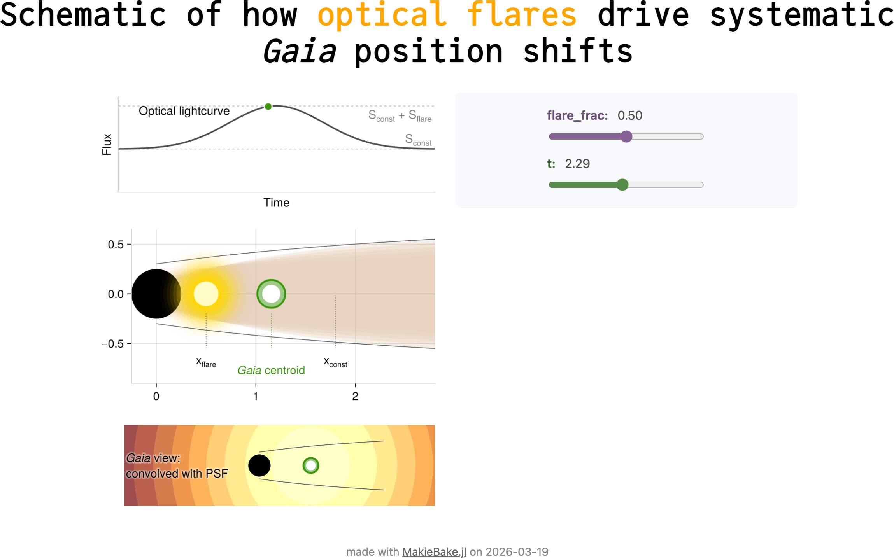
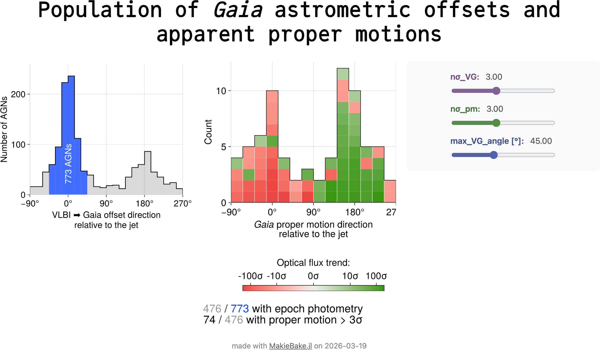

# *Gaia* Sees Blazars Move: Locating Optical Flares Using Astrometry

Reproduction code and interactive figures for the paper: Alexander Plavin, 2026, submitted.

## Interactive figures

| [Optical flares driving *Gaia* position shifts](https://aplavin.github.io/gaia_agn_motion/figs/interactive/corejet_cartoon/) | [*Gaia* astrometric offsets and proper motions](https://aplavin.github.io/gaia_agn_motion/figs/interactive/offset_pm_hist/) |
|---|---|
|  |  |

## Reproducing

Prerequisites: [Julia](https://julialang.org/) 1.10 and Make.

Running `make all` executes the full pipeline:
1. **Environment setup** — installs Julia dependencies (`Pkg.instantiate`)
2. **Data download** — fetches VLBI FITS images from Astrogeo (input catalogs are bundled in `data/raw/`)
3. **Calculation and fitting** — cross-matching, summary statistics, flare localization
4. **Plotting** — generates all paper figures

Output: static figures (PDF) in `figs/`, interactive figures (HTML) in `figs/interactive/`.

### Input data

Bundled in `data/raw/`:

| File | Description |
|---|---|
| `rfc_2025d_cat.txt` | RFC (Radio Fundamental Catalog) — precise VLBI radio source positions |
| `gaia_rfc_matches.vot.zst` | Gaia DR3 astrometry (positions, proper motions, errors) for RFC sources |
| `gaia_rfc_counts.csv.zst` | Gaia source density around each RFC source, for cross-match significance |
| `gaia_epoch_photometry.vot.zst` | Gaia DR3 epoch photometry — individual transit fluxes for light curves |

These catalogs are bundled for convenience; they can also be obtained from the original sources (RFC website, Gaia archive), but that depends on performance and availability of those upstread archives.

Additionally, VLBI clean-model FITS images for 25 sources are downloaded automatically during the build.
